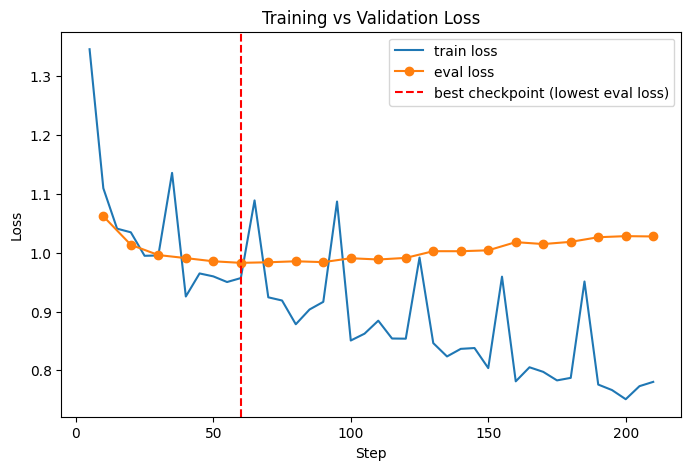

# AI Learning Coach

A fine-tuned LLM that teaches technical concepts in a consistent, mentor-style format — not just answering questions, but *teaching* them the way an experienced interviewer/mentor would.

Ask it about any technical topic — LLMs, SQL, Python, ML, Spark, statistics, deep learning, MLOps, GenAI — and it responds using the same structured teaching format every time, including for topics outside its original training set.

## Why I built this

Honestly, this project was about getting hands-on experience with fine-tuning an open-source model. I wanted to actually go through the process myself, not just read about how it works.

The "AI Learning Coach" idea was mostly a fun, concrete way to test that: could I train a model to explain concepts in a very specific, consistent format, just by fine-tuning it on examples of that format? It's not meant to be a tool most people would need day-to-day. It's a learning exercise, and a genuinely enjoyable one. If you're curious about what fine-tuning actually involves in practice, data prep, LoRA, picking the right number of epochs, watching a model start to overfit, this project walks through all of that concretely.

## The teaching format

Every response follows exactly these sections:

1. **What is it?**
2. **Why do we need it?**
3. **Real-world analogy**
4. **Example**
5. **Common mistake**
6. **Interview takeaway**
7. **Practice question**

This structure is enforced through the prompt used to generate training data (see [`dataset_generator/prompts.py`](dataset_generator/prompts.py)), not hardcoded — the model learned to reproduce this pattern through fine-tuning.

## How it works

### 1. Dataset generation
Located in [`dataset_generator/`](dataset_generator/):
- [`questions.py`](dataset_generator/questions.py) — a bank of technical interview-style questions across 10 categories (LLMs, SQL, Python, ML, Spark/Databricks, data engineering, statistics, deep learning, MLOps, GenAI)
- [`prompts.py`](dataset_generator/prompts.py) — the instructional prompt that enforces the 7-section teaching format
- [`generate_dataset.py`](dataset_generator/generate_dataset.py) — calls `gpt-4o-mini` for each question, saves each Q&A pair as one `{"messages": [...]}` line in `data/sft_dataset.jsonl`

This is essentially a distillation-style approach: a larger model (GPT-4o-mini) generates high-quality, consistently-structured training examples, and a much smaller model (Qwen2.5-3B) is then fine-tuned to reproduce that same style. In other words, knowledge from the bigger model gets passed down into the smaller one through the training data itself, rather than through direct copying.

### 2. Fine-tuning
Located in [`notebooks/AI_Learning_Coach_Fine_Tuning.ipynb`](notebooks/AI_Learning_Coach_Fine_Tuning.ipynb):
- Base model: **Qwen2.5-3B-Instruct**
- Method: **QLoRA** (4-bit quantization + LoRA adapters) — small enough to train on a single Colab GPU
- Dataset split: 80% train / 10% validation / 10% test
- Trained model pushed to the Hugging Face Hub

**Finding the right number of epochs:** rather than guessing, I trained for 7 epochs to observe the full validation loss curve. Eval loss bottomed out around step ~60 (roughly epoch 2), then slowly climbed — a clear overfitting signature once training continued past that point.



The best checkpoint (lowest eval loss) is automatically selected via `load_best_model_at_end=True` and pushed to the Hub — not the final, more-overfit checkpoint.

### 3. Demo interface
A [Gradio](https://gradio.app) chat interface wraps the fine-tuned model for interactive use, with streaming responses so answers appear live rather than all at once.

## Project structure

```
ai-learning-coach/
├── data/
│   └── sft_dataset.jsonl          # generated training data (question + structured answer pairs)
├── dataset_generator/
│   ├── generate_dataset.py        # generates the JSONL dataset via GPT-4o-mini
│   ├── prompts.py                 # the teaching-format prompt template
│   └── questions.py                # bank of technical questions across 10 categories
├── notebooks/
│   └── AI_Learning_Coach_Fine_Tuning.ipynb   # QLoRA fine-tuning + Gradio demo (run in Colab)
├── requirements.txt
└── README.md
```

## Running it yourself

### Generate the dataset
```bash
cd dataset_generator
pip install -r ../requirements.txt
# Add OPENAI_API_KEY to a .env file in the project root
python generate_dataset.py
```
Note: `requirements.txt` covers the dataset generator only. Training and inference dependencies are installed inline within the Colab notebook.

### Fine-tune and demo
Open [`notebooks/AI_Learning_Coach_Fine_Tuning.ipynb`](notebooks/AI_Learning_Coach_Fine_Tuning.ipynb) in Google Colab (GPU runtime recommended) and run through the cells — training, evaluation, and the Gradio demo cell at the end.

## Tech stack

- **Base model:** Qwen2.5-3B-Instruct
- **Fine-tuning:** QLoRA via `peft` + `trl` (`SFTTrainer`)
- **Dataset generation:** OpenAI `gpt-4o-mini`
- **Demo:** Gradio
- **Hosting:** Hugging Face Hub (model weights)

## Notes

- This is a personal learning/portfolio project, not a production system.
- The 3B parameter model isn't hosted as a live public demo (would require a paid GPU tier)